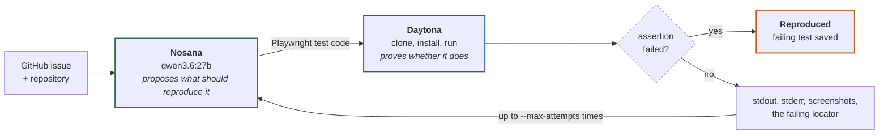

# Bug Reproduction Agent

**Turns a natural-language bug report into a deterministic failing test.**

A bug report is a claim. Before anyone can fix it, someone has to turn that
claim into something a machine can check — and most of that work is not writing
the test, it is discovering the conditions under which the bug appears at all.

This agent does that discovery as a loop. It asks a model how the bug might be
reproduced, runs that hypothesis in an isolated sandbox, and feeds the real
execution evidence back so the model can revise. It stops when the bug
reproduces, or when it has run out of attempts and says so.

> **[Nosana](https://nosana.com) proposes what should reproduce the bug.
> [Daytona](https://www.daytona.io) proves whether it does.**

The artifact at the end is a failing regression test an engineer — or another
coding agent — can work from.

## How it works



The return path is the design. A test that passes has not disproved the bug —
it has failed to create the conditions the bug needs, and the execution
evidence is what tells the model which conditions were missing.

Not every failure counts. Dependency installs fail, applications fail to start,
generated code has syntax errors and selectors miss. Execution results carry
the stage they reached, and only a Playwright assertion failure matching the
plan's expected failure is treated as a reproduction; everything else becomes
evidence for the next attempt.

## A run


Verbatim output of a run against a live Nosana deployment and a Daytona
sandbox. Only the pacing is compressed — a real run takes about twenty minutes,
most of it cloning, installing dependencies and downloading a browser inside
the sandbox.

### Why one pass is not enough

The demo issue reads: *after submitting the Create Campaign form, if
`POST /api/campaigns` fails, no error is shown to the user.*

Note the conditional. Against a healthy server that request **succeeds**, the
campaign is created, and there is no error to display. A test that simply fills
the form and submits it will pass — and passing here means nothing.

| | What happened |
|---|---|
| **Attempt 1** | Logs in, fills the form, asserts an error appears. Times out waiting for `getByRole('button', { name: /login/i })` — the button reads "Sign in". |
| **Attempt 2** | Reading that failure, the model fixes the selector *and* concludes the bug needs a failing API, so the test must cause the failure itself. It adds `page.route` interception returning 503 for the `POST` only. |
| **Result** | `Expected: visible / Received: hidden`. The error element exists and stays hidden, because the app catches the failure and only calls `console.log`. |

The agent was never told about request interception. It inferred that the
reported behaviour was conditional on a failure, and that a healthy application
would never produce one.

## Setup

```bash
python3 -m venv .venv
source .venv/bin/activate
pip install -r requirements.txt
cp .env.example .env
```

Fill in `.env`:

| Variable | |
|---|---|
| `NOSANA_BASE_URL` | Your deployment's endpoint. Ollama serves an OpenAI-compatible API, so any deployment works. |
| `NOSANA_MODEL` | Defaults to `qwen3.6:27b`. |
| `DAYTONA_API_KEY` | Required for sandbox execution. |

`.env` is gitignored. Nosana endpoints are unauthenticated and billed per
second, so treat the URL as a secret and shut the deployment down when you are
finished with it.

No credentials are needed to run the tests, or to run the agent with `--mock`.

## Usage

```bash
python -m src.main --repo <repo-url> --issue issue.txt
```

Options:

- `--repo` — GitHub repository URL
- `--issue` — path to a file containing the issue text
- `--ref` — commit or tag to pin the repository to; used for both context
  gathering and the sandbox clone (recommended: default branches move)
- `--max-attempts` — how many reproduction strategies to try (default 3)
- `--setup-command` — override dependency/setup commands
- `--start-command` — override the application start command
- `--mock` — use canned responses instead of Nosana and Daytona, for demoing
  without network access

Each attempt is written to `outputs/attempt-N/`, containing the generated test,
the plan that produced it, and the captured stdout and stderr. The exit code is
`0` when the bug reproduced and `1` when it did not.

## Selected demo

Both layers are live. Reproduction plans are generated by `qwen3.6:27b` on a
Nosana deployment and executed in a Daytona sandbox.

The bug is a real one in
[YesFundMe](https://github.com/Gauntlet-HQ/yes-build-me), pinned to
[`079886d`](https://github.com/Gauntlet-HQ/yes-build-me/blob/079886d51a871b2c4e43377a1a33e456d93cdd91/packages/client/src/pages/CreateCampaign.jsx#L15-L23)
because upstream may fix it: the catch block calls `console.log` where it
should set the error state the page is already prepared to render. See
[TASK1_DEMO.md](TASK1_DEMO.md).

```bash
python -m src.main \
  --repo https://github.com/Gauntlet-HQ/yes-build-me.git \
  --issue task1_fixture/issue.txt \
  --ref 079886d51a871b2c4e43377a1a33e456d93cdd91 \
  --setup-command "npm ci && npm run seed && npm install --no-save --package-lock=false @playwright/test@1.62.1 && npx playwright install --with-deps chromium" \
  --start-command "npm run dev"
```

The repository is pinned because the bug is real and upstream may fix it. A run
takes roughly ten minutes per attempt, most of it installing dependencies and
downloading a browser inside the sandbox.

### Without credentials

`--mock` runs the same loop against canned responses — useful for seeing the
shape of it, or demoing without network access. `task1_fixture/` also preserves
the logs, screenshot and classified result of a successful live Daytona run.


## Layout

```text
src/
  main.py        CLI and the reproduction loop
  models.py      Shared data models
  nosana.py      Test generation and refinement
  daytona.py     Sandbox execution
  context.py     Repository context gathering
  classifier.py  Reproduced vs not reproduced
  mocks.py       Canned responses for --mock
prompts/
  generate_test.md   First hypothesis
  refine_test.md     Revision, given execution evidence
tests/             47 tests, no credentials needed
task1_fixture/     The selected bug, and evidence from a live run
```

```bash
python -m unittest discover -s tests
```

The two recordings regenerate from committed tapes with `vhs demo.tape` and
`vhs demo-live.tape`; the latter replays `demo-live.log` through
`scripts/replay.sh`.

## What is verified

The loop has run end to end against a live Nosana deployment and a real Daytona
sandbox, and reproduced the demo bug on the second attempt. The GIF above is
that run's output.

Reproduction is not yet reliable run to run. The failure mode is selectors: the
model would write `/login/i` for a button reading "Sign in", and spend an
attempt discovering it. Both prompts now carry the source files and ask for
routes and labels quoted from them — a fix that is well understood but not yet
confirmed over repeated runs.

When the agent cannot reproduce a bug it says so rather than guessing. That is
the behaviour that matters most here: a false positive — a test that fails for
the wrong reason, reported as a confirmed bug — would be worse than no answer.
